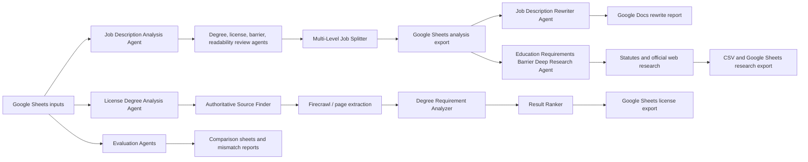

# Skills First Agent Map for Infographics

This map separates the runnable, queue-backed agents from the internal helper
agents they coordinate. The agent runner registers six public workflows:

- Job Description Analysis
- Job Description Rewriting
- Job Title License Degree Analysis
- Education Requirements Deep Research
- Job Description Sheet Comparison
- License Education Comparison

## One-Screen System View

## Runnable Agents

| Agent | Queue | What it does | Infographic label |
| --- | --- | --- | --- |
| `JobDescriptionAnalysisAgent` | `JOB_DESCRIPTION_ANALYSIS` | Main workflow for analyzing job descriptions for education requirements, licensing, barriers, consistency, and readability. Exports enriched records to Google Sheets. | "Analyze every job description" |
| `JobDescriptionRewriterAgent` | `JOB_DESCRIPTION_REWRITING` | Finds job descriptions whose reading level is too high for the required education level, rewrites them to about 10th-grade reading level, and exports before/after pairs to Google Docs. | "Rewrite inaccessible descriptions" |
| `JobTitleLicenseDegreeAnalysisAgent` | `JOB_TITLE_LICENSE_DEGREE_ANALYSIS` | Researches professional license types and determines whether initial licensure requires a college degree. Imports and exports through Google Sheets. | "Research license degree barriers" |
| `EducationRequirementsBarrierDeepResearchAgent` | `EDUCATION_REQUIREMENTS_DEEP_RESEARCH` | Takes jobs already found to have absolute associate or bachelor's requirements and searches statutes, regulations, official sources, and legal references for supporting evidence. | "Find legal basis for degree barriers" |
| `SheetsComparisonAgent` | `JOB_DESCRIPTION_COMPARE_SHEETS` | Compares job-description analysis outputs across spreadsheet connectors and asks the model which source is likely correct when fields disagree. | "Compare analysis sheets" |
| `CompareLicenseEducationAgent` | `COMPARE_LICENSE_EDUCATION` | Matches external profession degree data against Skills First job-description results and deep-research outputs, then writes a comparison sheet. | "Reconcile license education data" |

## Job Description Analysis Pipeline

Purpose: convert raw job descriptions into structured evidence about degree
requirements and accessibility barriers.

Input:
- Job descriptions in memory, usually loaded from Google Sheets or local HTML.

Output:
- `degreeAnalysis`, readability fields, validation fields, and Google Sheets export.

Flow:
1. `DetermineCollegeDegreeStatusAgent` detects whether the job requires higher education, the highest degree level referenced, evidence quotes, and whether multiple job levels are mixed together.
2. `ReviewEvidenceQuoteAgent` verifies that education evidence quotes actually support the extracted conclusion.
3. `DetermineMandatoryStatusAgent` decides whether a degree is absolute or whether alternative experience, credentials, or paths can substitute.
4. `DetermineProfessionalLicenseRequirementAgent` detects required licenses, issuing authorities, and whether the license itself implies a degree requirement.
5. `IdentifyBarriersAgent` summarizes language that may block or discourage non-degree applicants.
6. `ValidateJobDescriptionAgent` checks consistency across extracted fields.
7. `ReadabilityFleshKncaidJobDescriptionAgent` computes a Flesch-Kincaid grade locally.
8. `ReadingLevelAnalysisAgent` uses an LLM to estimate U.S. grade level and identify difficult passages.
9. `JobDescriptionMultiLevelAnalysisAgent` handles records marked as multi-level.
10. `SheetsJobDescriptionExportAgent` writes the final structured results to Sheets.

Infographic framing: show this as an assembly line from "Raw job text" to
"Structured barrier profile".

## Multi-Level Job Description Handling

Purpose: handle job descriptions that bundle multiple job levels into one text.

Flow:
1. `JobDescriptionMultiLevelAnalysisAgent` finds records marked `multiLevelJob`.
2. `SplitMultiLevelJobDescriptionAgent` extracts the text relevant to the current title code and title.
3. The normal `JobDescriptionAnalysisAgent` review chain runs again on the isolated level.

Infographic framing: show a single stacked posting splitting into separate level cards.

## Rewriting Pipeline

Purpose: make job descriptions easier to read when the reading level is higher
than the role's education requirement.

Flow:
1. `DifferenceAnalysisAgent` compares the required education level with the assessed reading level.
2. `JobDescriptionBucketAgent` groups mismatched jobs by occupational category.
3. `JobDescriptionRewriterMasterAgent` manages rewrite attempts for each selected job.
4. `RewriteSubAgent` rewrites the full description to roughly 10th-grade reading level while preserving content.
5. `ParallelCheckAgents` can optionally verify preservation, hallucination risk, and reading level.
6. `JobDescriptionPairExporter` sends original and rewritten pairs to Google Docs.

Infographic framing: show "hard-to-read posting" through a rewrite loop into
"same content, clearer language".

## License Degree Analysis Pipeline

Purpose: determine whether professional licenses create hidden degree barriers.

Input:
- License rows from Google Sheets, including license type, source links, and issuing authority.

Output:
- Ranked license-degree findings written back to Google Sheets.

Flow:
1. `SheetsLicenseDegreeImportAgent` imports license rows.
2. `AuthoritativeSourceFinderAgent` searches for official URLs using `LicenseDeepResearchAgent`.
3. `FirecrawlScrapeAndCrawlerAgent` crawls or scrapes likely source pages and filters for possible relevance.
4. `RequirementExtractorAgent` can extract text from HTML, PDF, spreadsheet, or text sources.
5. `DegreeRequirementAnalyzerAgent` classifies the degree requirement status, evidence, confidence, and reasoning.
6. `LicenseDegreeResultsRanker` ranks multiple findings by source authority and evidence quality.
7. `SheetsLicenseDegreeExportAgent` exports results.

Infographic framing: show "License type" to "Official source" to "Degree status".

## Legal Education Barrier Research Pipeline

Purpose: find official legal or regulatory support for degree requirements already
identified in job-description analysis.

Input:
- Job descriptions whose analysis says a bachelor's or associate degree is absolutely required.

Output:
- Research results in memory, appended CSV rows, and Google Sheets export.

Flow:
1. `EducationRequirementsBarrierDeepResearchAgent` filters qualifying jobs.
2. `ProcessAndScanStatuesAgent` loads New Jersey statutes from Google Drive or local text, chunks them, and extracts job-title degree mentions.
3. `JobTitleDeepResearchAgent` searches official New Jersey legal, regulatory, policy, court, and related sources.
4. `EducationRequirementAnalyzerAgent` determines the degree requirement type, document type, match type, and mandatory status from source text.
5. `SheetsEducationRequirementExportAgent` exports the aggregated evidence.

Infographic framing: show "Potential barrier" connected to "official evidence".

## Evaluation And Comparison Agents

`SheetsComparisonAgent`:
- Imports analyzed job descriptions from every spreadsheet connector.
- Compares key fields such as degree requirement, mandatory status, license data, and readability.
- Uses the model to identify likely correct connectors when values disagree.

`CompareLicenseEducationAgent`:
- Reads profession degree data, Skills First education-requirement data, and deep-research degree data from separate sheets.
- Matches license/profession names to Skills First jobs.
- Outputs whether education requirements appear aligned.

Infographic framing: show these as quality-control agents, not primary analysis agents.

## Shared Deep Research Layer

The deep-research layer is reused by license research and legal/job-title research.

Flow:
1. `SearchQueriesGenerator` creates targeted search queries.
2. `SearchQueriesRanker` selects the best queries using pairwise ranking.
3. `ResearchWeb` runs web searches.
4. `SearchResultsRanker` ranks search results.
5. `WebPageScanner` can fetch pages and run source-specific extraction prompts.
6. `DeepResearchWebContentRanker` ranks analyzed page content.
7. Deduplication agents can merge repeated findings by keys or object similarity.

Infographic framing: show this as a reusable "research engine" underneath the
license and legal-research workflows.

## Data Movement Agents

| Agent | Role |
| --- | --- |
| `SheetsJobDescriptionImportAgent` | Loads job descriptions from Google Sheets into structured memory. |
| `SheetsJobDescriptionExportAgent` | Writes analyzed job-description results to Google Sheets. |
| `SheetsLicenseDegreeImportAgent` | Loads license-degree research rows from Google Sheets. |
| `SheetsLicenseDegreeExportAgent` | Writes license-degree analysis results to Google Sheets. |
| `SheetsEducationRequirementExportAgent` | Writes legal education-requirement research results to Google Sheets. |
| `JobDescriptionPairExporter` | Writes original/revised job-description pairs to Google Docs. |

## Suggested Infographic Grouping

Use four large color-coded lanes:

1. Job Description Analysis: raw job descriptions to structured degree, license, barrier, and readability profile.
2. Accessibility Rewriting: high reading-level descriptions to clearer 10th-grade versions.
3. License and Legal Research: external official sources to verified degree-barrier evidence.
4. Evaluation and Data Quality: compare sheets, reconcile license data, and flag disagreements.

Use smaller reusable-service badges:

- "Google Sheets / Docs / Drive connectors"
- "Deep research engine"
- "LLM analysis"
- "Pairwise ranking"
- "Memory and exports"

## Source Files

- `src/runAgents.ts`
- `src/jobDescriptions/analysisAgent.ts`
- `src/jobDescriptions/rewriterAgent.ts`
- `src/jobDescriptions/licenceDegrees/licenceAnalysisAgent.ts`
- `src/legalResearch/educationRequirementsBarrierDeepResearchAgent.ts`
- `src/jobDescriptions/README.md`
- `src/jobDescriptions/reviewAgents/README.md`
- `src/jobDescriptions/rewriting/README.md`
- `src/jobDescriptions/licenceDegrees/README.md`
- `src/legalResearch/README.md`
