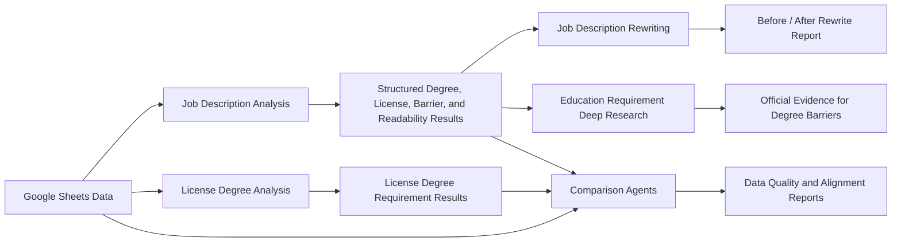

# Skills First Agents: Simple Infographic Map

This version shows only the main Skills First agent workflows. It avoids the
internal sub-agent steps so it can be used directly as a simple infographic brief.

## Simple System View

## Main Agents

| Agent | Plain-language role | Main output |
| --- | --- | --- |
| `JobDescriptionAnalysisAgent` | Reviews job descriptions to identify degree requirements, license requirements, barriers for non-degree applicants, and readability issues. | Enriched job-description analysis in Google Sheets |
| `JobDescriptionRewriterAgent` | Rewrites job descriptions that are harder to read than the role requires. | Original/revised job-description pairs in Google Docs |
| `JobTitleLicenseDegreeAnalysisAgent` | Researches whether professional licenses require college degrees. | License-degree findings in Google Sheets |
| `EducationRequirementsBarrierDeepResearchAgent` | Looks for official legal or regulatory evidence behind degree requirements found in job descriptions. | Evidence records in CSV and Google Sheets |
| `SheetsComparisonAgent` | Compares job-description analysis results across spreadsheets to find mismatches. | Field-level data quality report |
| `CompareLicenseEducationAgent` | Compares profession/license education data with Skills First job-description and research data. | License education comparison sheet |

## Four Infographic Lanes

1. Job Description Analysis: turns raw job descriptions into structured barrier profiles.
2. Plain-Language Rewriting: turns overly complex descriptions into clearer versions.
3. License and Legal Research: connects degree requirements to official source evidence.
4. Data Quality Checks: compares spreadsheets and flags disagreement between sources.

## Short Copy Blocks

**Job Description Analysis**
Finds where degrees, licenses, and complex language may create barriers in job descriptions.

**Plain-Language Rewriting**
Keeps the job content intact while making selected descriptions easier to read.

**License Degree Analysis**
Checks whether required professional licenses create hidden college-degree requirements.

**Legal Evidence Research**
Looks for statutes, regulations, policies, or other official sources that support degree requirements.

**Comparison Agents**
Review spreadsheet outputs and help identify mismatches across datasets.

## Suggested Visual Treatment

Use one large flow from left to right:

`Source Data` -> `Analyze` -> `Research` -> `Rewrite` -> `Compare` -> `Outputs`

Use six agent cards beneath the flow, one for each main agent. Each card only
needs three fields: agent name, one-sentence purpose, and output destination.
